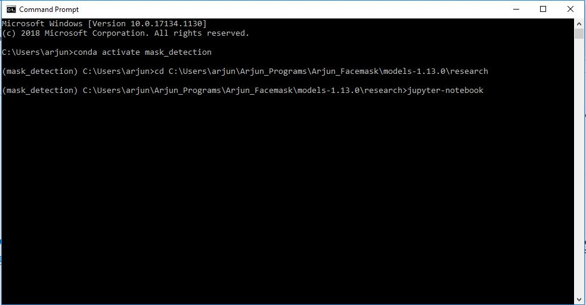
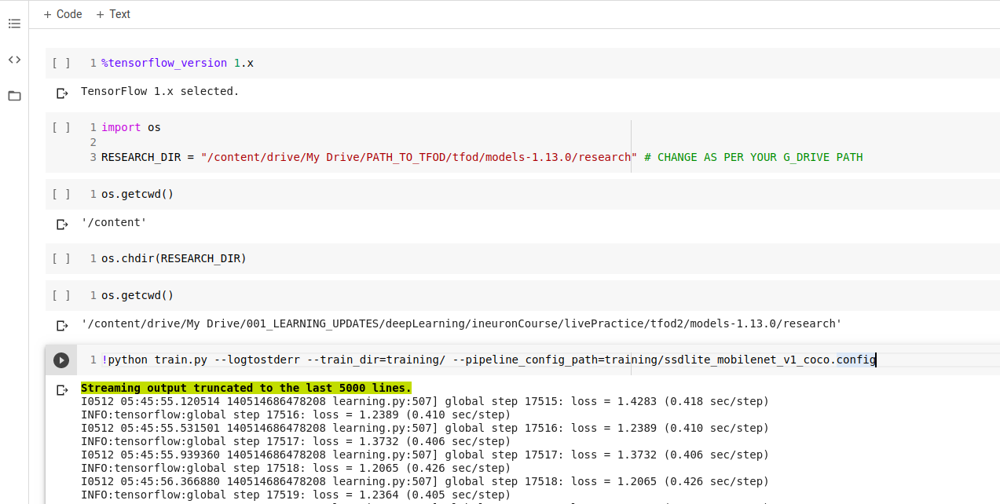
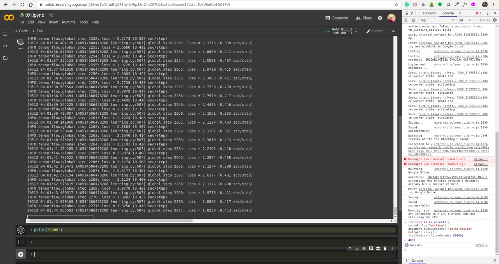
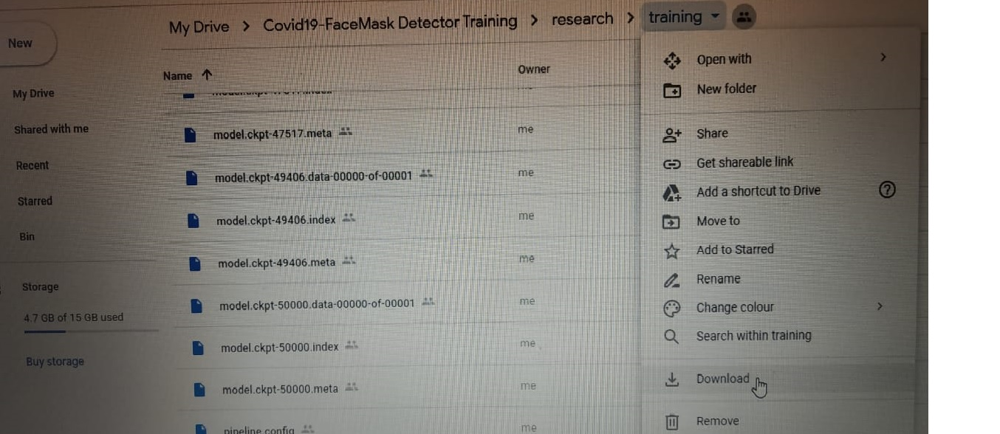
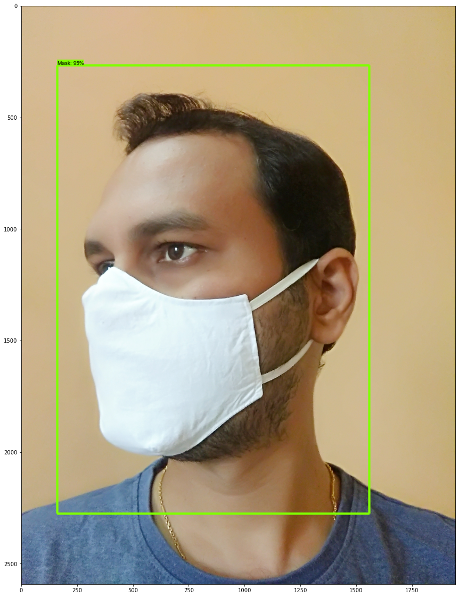
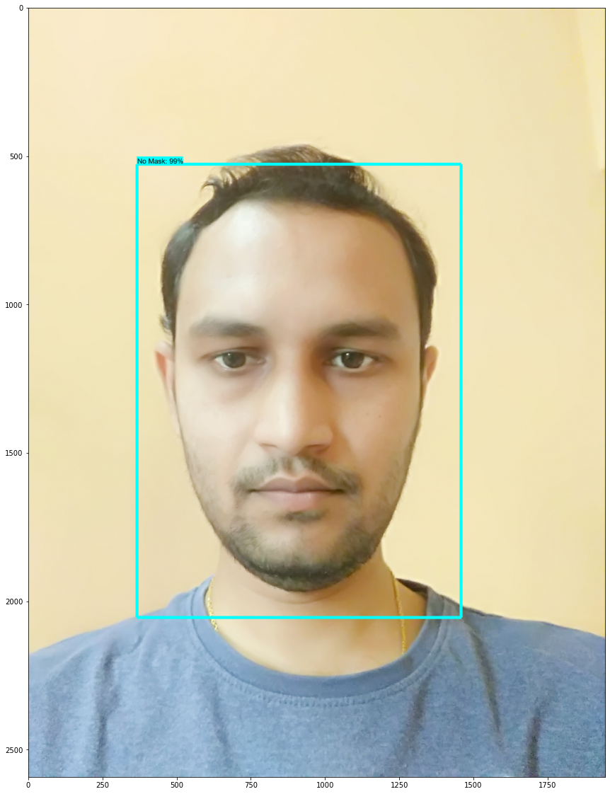

<h1>FaceMask_detection</h1>

I have developed this face mask detector using 1500 images with and without mask pics taken from internet and done some augmentation methods in images.
I trained the neural network using SSD_MobileNet_V1 from TFOD Zoo model in google colab with Tesla processor
It tooks 4hrs in google colab with 20000 epochs and then tested in my local system.

1. Setup your environment and installed the packages required ,briefly provided in tfod_setup file.
 

<h1>Note -- Follow tfod_setup instructions till Step-16 bcoz Step-17 is training in local system and u can perform below lines for faster training in Google Colab </h1>

2.I have trained in google colab so for that you have to mount your google drive in google colab and in google drive upload the file content of models
   
    Steps in google colab
   
     a. %tensorflow_version 1.x

     b. import os
     RESEARCH_DIR = "/content/drive/My Drive/PATH_TO_TFOD/tfod/models-1.13.0/research" #Provide your path

     c. os.chdir(RESEARCH_DIR)

     d. os.getcwd()

     e. This is training code in python !python train.py --logtostderr --train_dir=training/ --pipeline_config_path=training/ssdlite_mobilenet_v1_coco.config

     f. Copy and paste following code in your browser console(To open console Press Ctrl+Shift+I and paste it) to prevent Google Colab from terminating- JS code1-
         
            function ClickConnect(){
            console.log("Working"); 
            document.querySelector("colab-toolbar-button").click() 
            }setInterval(ClickConnect,60000)
      
  
  
  
 3.After training is done in Colab then checkpoint files are created in Training folder in Models\Research\Training.Download and replace in your local system
    for generating .pb file from ckpt file and then further testing. 
    
    
    
 4.Then you can proceed from Step-18 in tfod_setup file and convert ckpt files into pb file and then run your object detection tutorial file and can test images.
 
    
    
    
    
 5.In case you are not able to train in google colab,I have uploaded inference graph folder in github then you need to follow from Step-19 as Step-18 is performed just u need to download inference graph folder and paste it in models\research folder and then you can test it.   
  
 
 
